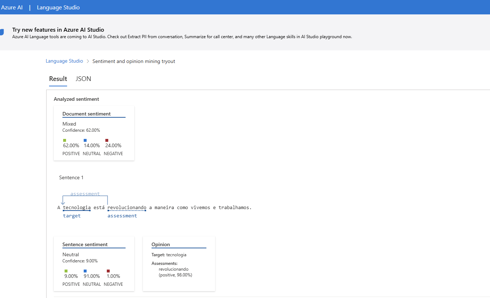

# azure-servico-fala

## Passo 1 - Adicionando texto no input da IA 
### A IA irá ler o texto e fazer uma análise

---
## Passo 2 - Análise
### A IA Irá analisar o texto e trazer algumas opinões e estátisticas sobre os tópicos de mais destaque, além de trazer uma relação de sentimentos em porcentagem
